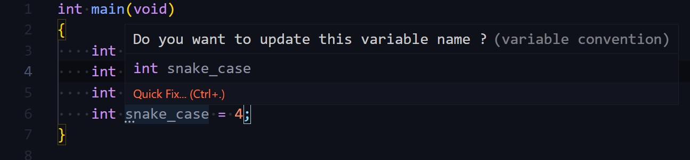
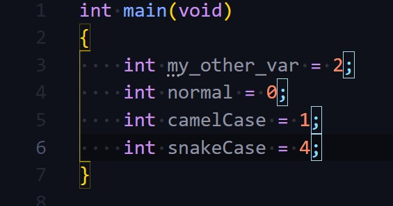
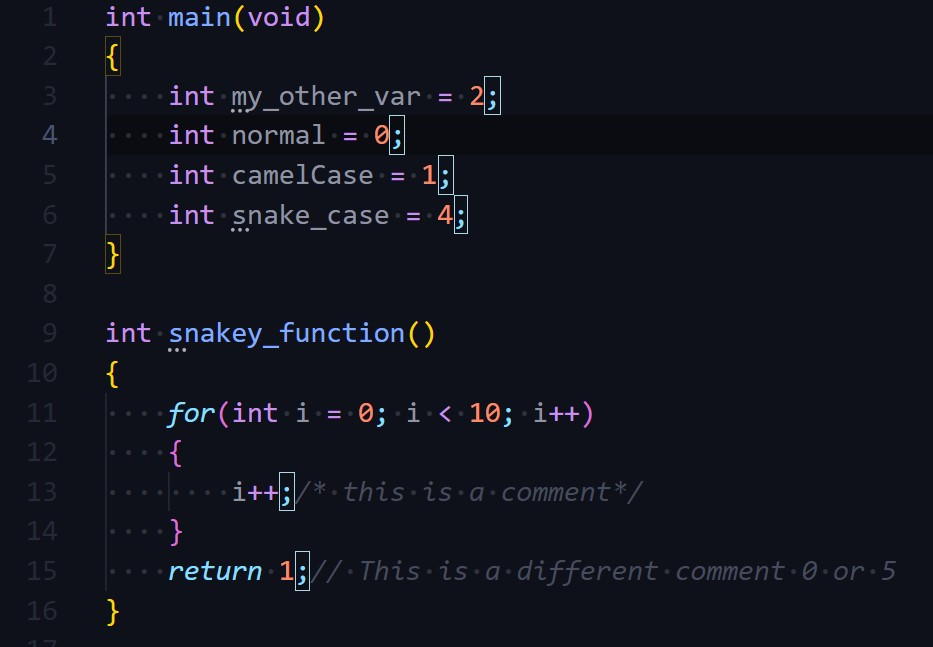

# var-convention
A simple VS Code Extension to deal with common issues faced by a beginner, to enforce good programming standards and assist with typical mistakes. This extension works for C Language only.

## Features

> Convention Assistant
This feature assists in keeping uniform naming conventions throught your code file.

This is how your code would look when it uses snake_case names
When you hover over the word highlighted by three underlying dots, this screen prompts you to change the variable name to match the convention.

On clicking the quick fix option, it offers to change the variable name for you to appropriate case.

Final Result

> SemiColon Highlighter
Highlights semicolons when needed to give visual feedback that you have not missed them. 
This lack of this habit results in a lot of frustration in the first week, this feature aims to curb that. An example of this syntax highlighting is shown below

## Known Issues

* Need tests to ensure ';' gets highlighted only at end of statements, while ensuring comments and other whitespace doesnt get affected
* Not being able to use keyboard shortcut to change variable naming case.

## Release Notes

The Current Version of this application is pre-release.
### 0.0.1

Alpha Phase of working, upcoming features :
* Option to choose between snake_case and CamelCase as choice of convention.
* New Command/ Dialogue prompt to guide in naming variables

-----------------------------------------------------------------------------------------------------------
